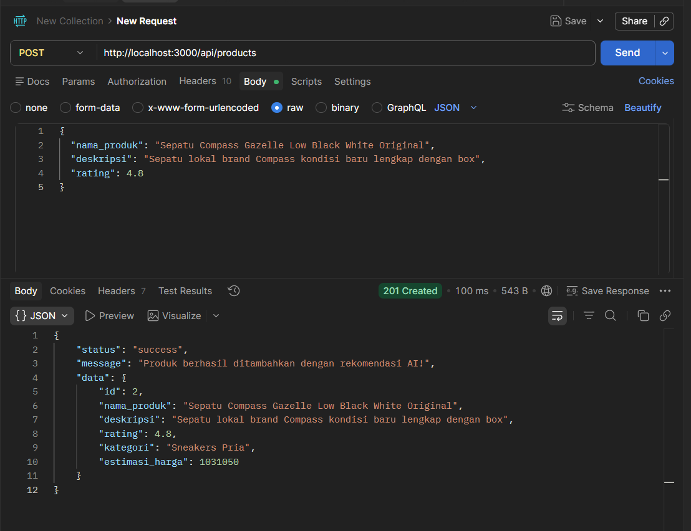
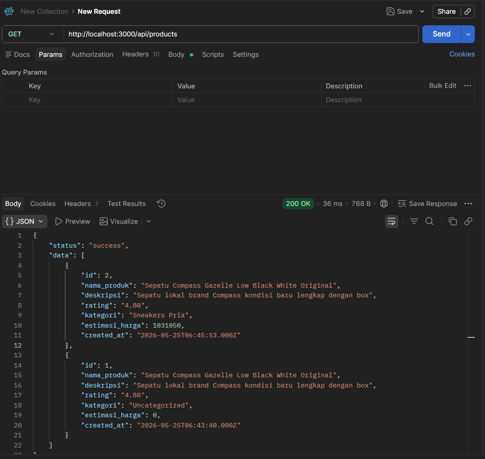
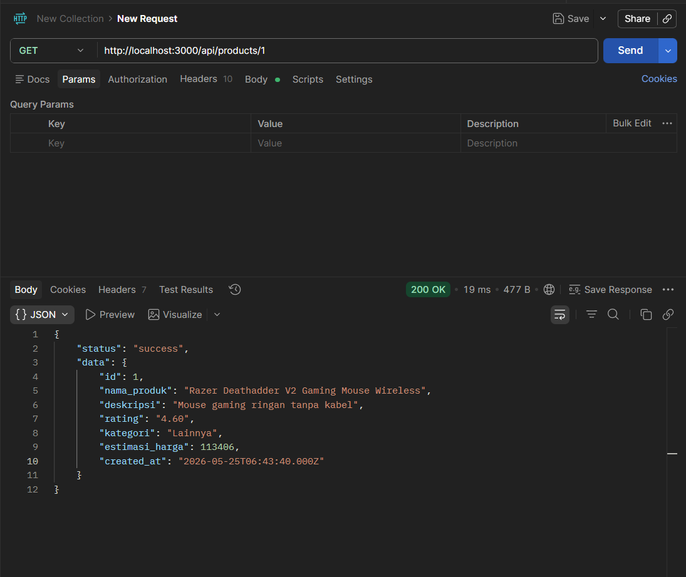
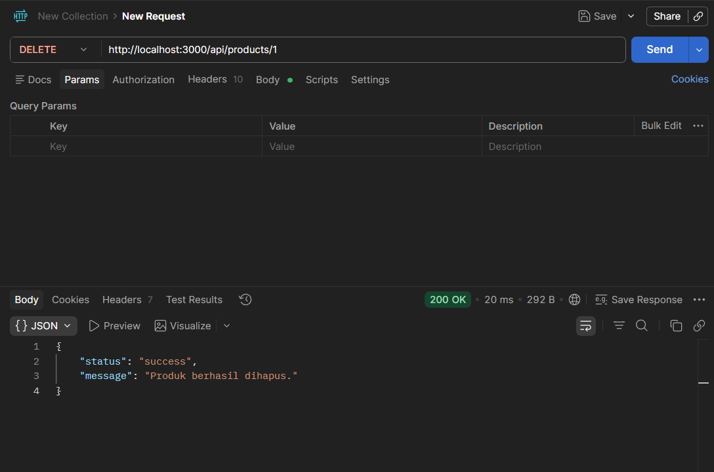

# 🛒 E-Commerce API with ML Auto-Tagging

Aplikasi backend e-commerce berbasis **microservice** yang dilengkapi Machine Learning untuk auto-tagging kategori produk dan estimasi harga secara otomatis menggunakan data Tokopedia 2025.

---

## 📋 Daftar Isi

- [Arsitektur Sistem](#-arsitektur-sistem)
- [Tech Stack](#-tech-stack)
- [Struktur Proyek](#-struktur-proyek)
- [Cara Menjalankan](#-cara-menjalankan)
- [API Endpoints](#-api-endpoints)
- [Testing dengan Postman](#-testing-dengan-postman)
- [ML Service](#-ml-service)

---

## 🏗️ Arsitektur Sistem

Proyek ini terdiri dari **3 service** yang berjalan dalam Docker container:

```
┌─────────────────────────────────────────────────┐
│                  Docker Network                  │
│                                                 │
│  ┌──────────────┐      ┌──────────────────────┐ │
│  │  ML Service  │◄─────│  Gateway Service     │ │
│  │  (Python /   │      │  (Express.js / 3000) │ │
│  │  FastAPI 8000)│      └──────────┬───────────┘ │
│  └──────────────┘                 │             │
│                           ┌───────▼──────────┐  │
│                           │  MySQL Database  │  │
│                           │  (Port 3306)     │  │
│                           └──────────────────┘  │
└─────────────────────────────────────────────────┘
```

| Service           | Teknologi             | Port   | Fungsi                             |
| ----------------- | --------------------- | ------ | ---------------------------------- |
| `gateway-service` | Express.js (Node 20)  | `3000` | API Gateway & CRUD Produk          |
| `ml-service`      | FastAPI (Python 3.11) | `8000` | Prediksi Kategori & Estimasi Harga |
| `mysql-db`        | MySQL 8.0             | `3306` | Penyimpanan Data Produk            |

---

## 🧰 Tech Stack

**Backend (Gateway)**

- Node.js 20 + Express.js v5
- MySQL2 (connection pool)
- Axios (HTTP client ke ML service)
- Dotenv

**Machine Learning Service**

- Python 3.11 + FastAPI
- Scikit-learn (Logistic Regression + Random Forest)
- Pandas + TF-IDF Vectorizer
- Uvicorn (ASGI server)

**Infrastructure**

- Docker & Docker Compose
- MySQL 8.0

---

## 📁 Struktur Proyek

```
ecommerce-app/
│
├── docker-compose.yml
│
├── service_utama/              # Express.js API Gateway
│   ├── Dockerfile
│   ├── package.json
│   ├── server.js
│   ├── config/
│   │   └── db.js               # Konfigurasi MySQL pool & inisialisasi tabel
│   ├── controllers/
│   │   └── product.controller.js
│   └── routes/
│       └── product.route.js
│
└── service_python/             # FastAPI ML Service
    ├── Dockerfile
    ├── requirements.txt
    ├── app.py                  # FastAPI app & endpoint prediksi
    ├── train.py                # Script training model ML
    ├── products.csv            # Dataset Tokopedia (lokal)
    └── models/                 # Output model .pkl (di-generate oleh train.py)
        ├── model_kategori.pkl
        └── model_harga.pkl
```

---

## 🚀 Cara Menjalankan

### Prasyarat

- [Docker](https://www.docker.com/get-started) & Docker Compose terinstall
- Dataset `products.csv` sudah tersedia di folder `service_python/`

### Langkah 1 — Training Model ML (Wajib dilakukan sekali)

Sebelum menjalankan Docker, model ML harus di-training terlebih dahulu agar file `.pkl` tersedia.

```bash
cd service_python
pip install -r requirements.txt
python train.py
```

Output yang diharapkan:

```
--> Membaca dataset lokal 'products.csv'...
--> Total data yang siap digunakan untuk training: XXXXX baris.
--> Memulai training Model Kategori (Klasifikasi)...
✓ models/model_kategori.pkl berhasil disimpan!
--> Memulai training Model Estimasi Harga (Regresi)...
✓ models/model_harga.pkl berhasil disimpan!
```

### Langkah 2 — Jalankan Semua Service dengan Docker Compose

```bash
# Di root folder proyek
docker-compose up --build
```

Semua service akan berjalan secara otomatis. Tunggu hingga muncul log:

```
ecommerce-gateway  | API Gateway berjalan di http://localhost:3000
ecommerce-gateway  | Database & Tabel "products" siap digunakan.
ecommerce-ml       | ✓ Semua model .pkl berhasil dimuat.
```

### Menghentikan Service

```bash
docker-compose down
```

---

## 📡 API Endpoints

Base URL: `http://localhost:3000/api`

| Method   | Endpoint        | Deskripsi                                                       |
| -------- | --------------- | --------------------------------------------------------------- |
| `POST`   | `/products`     | Tambah produk baru (dengan prediksi AI)                         |
| `GET`    | `/products`     | Ambil semua produk                                              |
| `GET`    | `/products/:id` | Ambil produk berdasarkan ID                                     |
| `PUT`    | `/products/:id` | Update produk (prediksi AI diperbarui jika nama/rating berubah) |
| `DELETE` | `/products/:id` | Hapus produk                                                    |

### Request Body — POST & PUT `/products`

```json
{
  "nama_produk": "Kaos Polos Cotton Combed 30s Premium",
  "deskripsi": "Kaos berkualitas tinggi, bahan adem dan nyaman",
  "rating": 4.8
}
```

| Field         | Tipe     | Wajib    | Keterangan                                      |
| ------------- | -------- | -------- | ----------------------------------------------- |
| `nama_produk` | `string` | ✅ Ya    | Nama produk (digunakan untuk prediksi kategori) |
| `deskripsi`   | `string` | ❌ Tidak | Deskripsi produk                                |
| `rating`      | `float`  | ❌ Tidak | Nilai 1.0 – 5.0, default `5.0`                  |

### Contoh Response Sukses — POST `/products`

```json
{
  "status": "success",
  "message": "Produk berhasil ditambahkan dengan rekomendasi AI!",
  "data": {
    "id": 1,
    "nama_produk": "Kaos Polos Cotton Combed 30s Premium",
    "deskripsi": "Kaos berkualitas tinggi, bahan adem dan nyaman",
    "rating": 4.8,
    "kategori": "Fashion Pria",
    "estimasi_harga": 75000
  }
}
```

---

## 🧪 Testing dengan Postman

### 1. POST — Tambah Produk Baru

Endpoint ini akan secara otomatis memanggil ML service untuk mendapatkan kategori dan estimasi harga.

**Request:**

- Method: `POST`
- URL: `http://localhost:3000/api/products`
- Body: `raw` → `JSON`

```json
{
  "nama_produk": "Kaos Polos Cotton Combed 30s Premium",
  "deskripsi": "Kaos berkualitas tinggi, bahan adem dan nyaman",
  "rating": 4.8
}
```

> 📸 **Screenshot — POST Create Product**
>
> 

---

### 2. GET — Ambil Semua Produk

**Request:**

- Method: `GET`
- URL: `http://localhost:3000/api/products`

> 📸 **Screenshot — GET All Products**
>
> 

---

### 3. GET — Ambil Produk by ID

**Request:**

- Method: `GET`
- URL: `http://localhost:3000/api/products/1`

> 📸 **Screenshot — GET Product by ID**
>
> 

---

### 4. PUT — Update Produk

Jika `nama_produk` atau `rating` berubah, sistem akan otomatis memperbarui prediksi ML.

**Request:**

- Method: `PUT`
- URL: `http://localhost:3000/api/products/1`
- Body: `raw` → `JSON`

```json
{
  "nama_produk": "Sepatu Sneakers Pria Nike Air Max Original",
  "rating": 4.5
}
```

> 📸 **Screenshot — PUT Update Product**
>
> 

---

### 5. DELETE — Hapus Produk

**Request:**

- Method: `DELETE`
- URL: `http://localhost:3000/api/products/1`

> 📸 **Screenshot — DELETE Product**
>
> 

---

## 🤖 ML Service

ML Service berjalan secara independen di `http://localhost:8000` dan dapat diakses langsung untuk keperluan testing.

### Endpoint ML — Prediksi Metadata Produk

- **URL:** `POST http://localhost:8000/predict-metadata`
- **Body:**

```json
{
  "nama_produk": "Smartphone Samsung Galaxy A55 5G",
  "rating": 4.7
}
```

- **Response:**

```json
{
  "status": "success",
  "data": {
    "kategori_otomatis": "Handphone & Tablet",
    "estimasi_harga": 4500000
  }
}
```

### Endpoint Health Check

- **URL:** `GET http://localhost:8000/health`
- **Response:** `{ "status": "healthy" }`

### Dokumentasi Interaktif (Swagger UI)

FastAPI secara otomatis menghasilkan dokumentasi API yang dapat diakses di:

```
http://localhost:8000/docs
```

### Cara Kerja Model ML

**Model Kategori (Klasifikasi)**

- Algoritma: Logistic Regression
- Fitur input: Nama produk (diproses dengan TF-IDF Vectorizer, max 5000 fitur)
- Output: Nama kategori produk

**Model Estimasi Harga (Regresi)**

- Algoritma: Random Forest Regressor (100 estimator)
- Fitur input: Kategori (OneHotEncoded) + Rating
- Output: Estimasi harga dalam Rupiah

---

## ⚙️ Environment Variables

Konfigurasi untuk `gateway-service` (didefinisikan di `docker-compose.yml`):

| Variable         | Default                  | Keterangan                           |
| ---------------- | ------------------------ | ------------------------------------ |
| `PORT`           | `3000`                   | Port Express.js                      |
| `DB_HOST`        | `mysql-db`               | Hostname MySQL (nama service Docker) |
| `DB_USER`        | `root`                   | Username MySQL                       |
| `DB_PASSWORD`    | `rootpassword`           | Password MySQL                       |
| `DB_NAME`        | `db_ecommerce`           | Nama database                        |
| `ML_SERVICE_URL` | `http://ml-service:8000` | URL ML Service                       |

---

## 📝 Catatan Penting

- Model ML menggunakan **fallback graceful**: jika ML service tidak merespons saat membuat/update produk, data tetap tersimpan dengan nilai default (`kategori: "Uncategorized"`, `estimasi_harga: 0`).
- Tabel `products` dibuat otomatis saat pertama kali Gateway Service dijalankan.
- File `products.csv` **tidak ikut** di-copy ke Docker image (tercantum di `.dockerignore`); training harus dilakukan sebelum build image.
